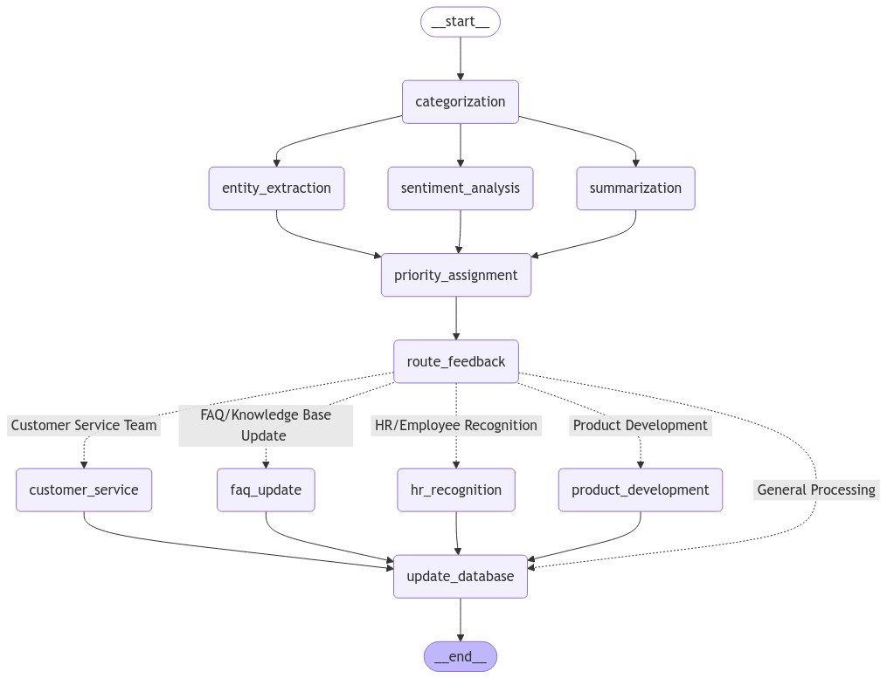
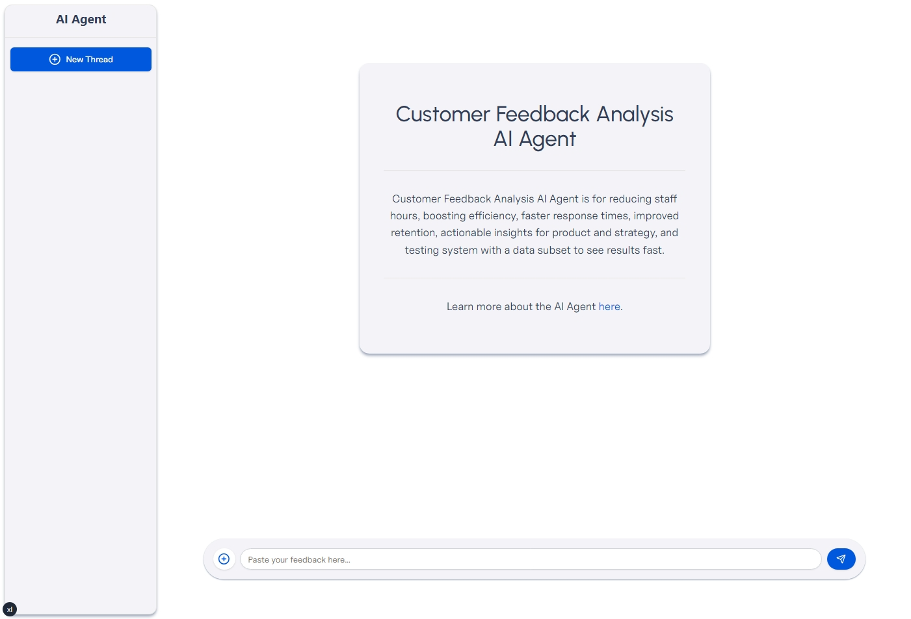
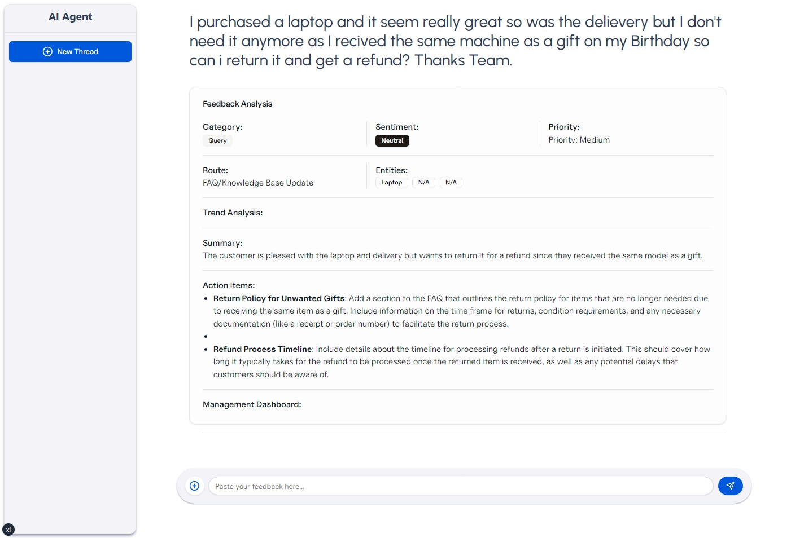

# Custom Feedback Analysis AI Agent

### Agent Workflow



### Agent in Action




This project is a Customer Feedback Analysis AI Agent that generates insights and action items based on customer feedback.

It is powered by `LangGraph`, `Vercel AI SDK`, `gpt-4o-mini`, `FastAPI`, and `Next.js`.

## Quickstart (Windows, venv + pip)

The steps below use the Windows PowerShell shell and avoid Poetry, using the built-in `py -m` flow instead.

### 1) Backend (FastAPI) — agent-service

Prereqs: Python 3.12 or 3.13 installed and available as `py`.

```powershell
# From repo root
cd C:\PROJECTS\customer-feedback-analysis\agent-service

# Create and activate a virtual environment
py -m venv .venv
./.venv/Scripts/Activate.ps1

# Install dependencies
py -m pip install --upgrade pip
py -m pip install -r requirements.txt

# Configure environment
Copy-Item .env.example .env -Force
# EITHER enable demo mode (no external LLM calls):
Add-Content .env "`nDEMO_MODE=true"
# OR set your real key later by editing .env and setting OPENAI_API_KEY=<your_key>

# Run the server
$env:PYTHONPATH = (Get-Location).Path
py run_server.py
```

Verify endpoints in another terminal:

```powershell
Invoke-WebRequest -Uri http://127.0.0.1:8000/health -Method GET
Invoke-WebRequest -Uri http://127.0.0.1:8000/ -Method GET
Invoke-WebRequest -Uri "http://127.0.0.1:8000/analyze" -Method POST -ContentType "application/json" -Body '{"feedback":"I love the new product features, they are amazing!"}'
```

Notes:
- The service binds to http://127.0.0.1:8000.
- With `DEMO_MODE=true`, `/analyze` returns deterministic mock results so you won’t see 429 quota errors.

### 2) Frontend (Next.js) — agent-ui

Prereqs: Node.js 18+ and your package manager (`npm` or `pnpm`).

```powershell
# From repo root
cd C:\PROJECTS\customer-feedback-analysis\agent-ui

# Install deps
npm install
# or: pnpm install

# Configure environment (backend URL)
Set-Content -Path .env.local -Value "NEXT_PUBLIC_AGENT_SERVICE_URL=http://127.0.0.1:8000"

# Start dev server (http://localhost:3000)
npm run dev
# or: pnpm dev
```

Open http://localhost:3000 in your browser and try sending feedback. The app is set up to work without external auth for local development.

### Troubleshooting

- Execution policy prevents venv activation:
   ```powershell
   Set-ExecutionPolicy -ExecutionPolicy RemoteSigned -Scope CurrentUser
   ```
- `ModuleNotFoundError: No module named 'app'` when starting backend:
   Ensure you set `PYTHONPATH` to the agent-service folder before running Uvicorn, or use `py run_server.py` as shown.
- `Address already in use` on port 8000:
   Stop any previous server, or pick another port: `py -m uvicorn app.main:app --host 127.0.0.1 --port 8010` and update the frontend env URL accordingly.
- `/analyze` returns 429 quota error:
   Use `DEMO_MODE=true` in `agent-service/.env`, or add a valid `OPENAI_API_KEY`.

## Tech Stack

- [LangGraph](https://langchain-ai.github.io/langgraph/)
- [Vercel AI SDK](https://sdk.vercel.ai/docs/introduction)
- [OpenAI GPT-4o Mini](https://platform.openai.com/docs/models/gpt-4o-mini)
- [FastAPI](https://fastapi.tiangolo.com/)
- [Next.js App Router](https://nextjs.org/)

## Try it out

1. Create `.env` files and configure keys/URLs as shown above.
2. Follow Backend and Frontend setup steps in the Quickstart sections.
3. Open http://localhost:3000 and paste your customer feedback; press Enter to generate insights.
